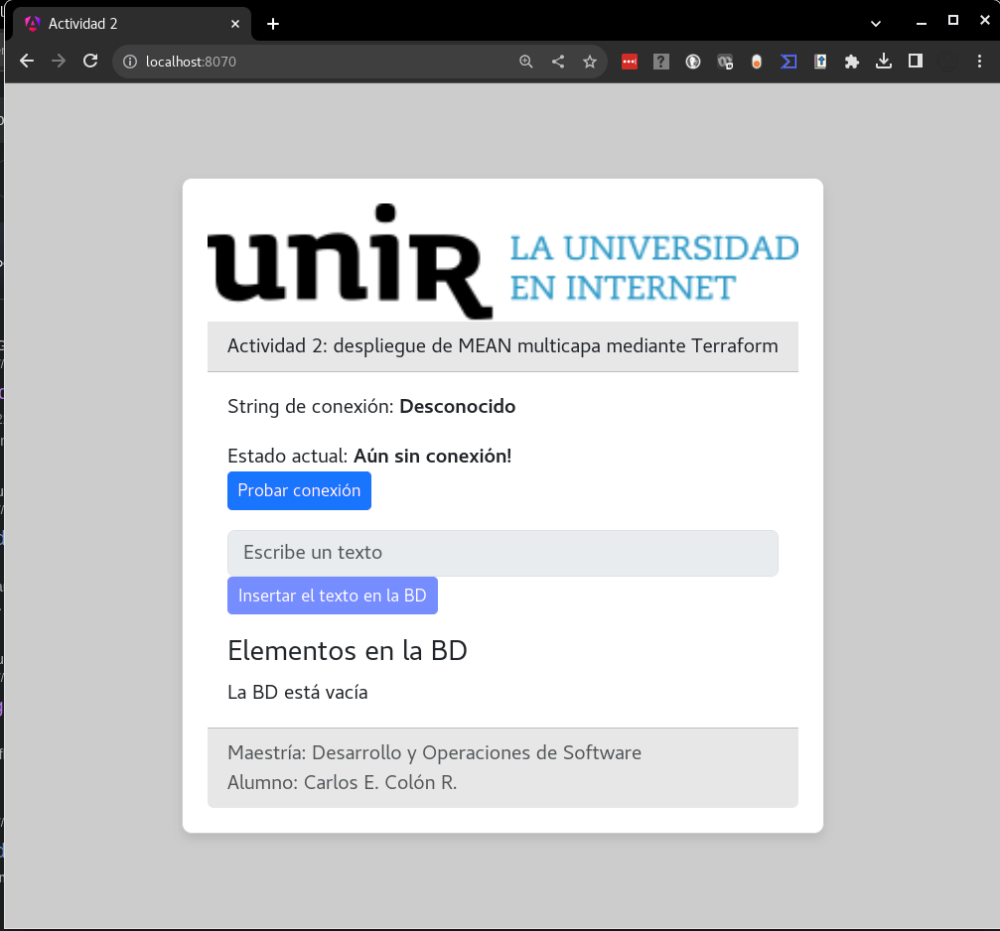

# Aplicación MEAN

Una aplicación MEAN es aquella que está ensamblada por:

- Una base de datos **M**ongoDB.
- Una aplicación que sea el backend desarrollada en NodeJS y **E**xpress.
- Una aplicación que sea el frontend desarrollada en **A**ngular y que sea expuesta con **N**ginx.

La aplicación que he desarrollado para este proyecto tiene los tres módulos descritos anteriormente.

## La base de datos MongoDB

No hay personalización para este elemento, tal cual viene desde Docker Hub, así será desplegado.

## El backend

Puedes encontrar información detallada en el siguiente enlace: [El backend](backend/README.md)

## El frontend

Puedes encontrar información detallada en el siguiente enlace: [El frontend](frontend/README.md)

## Cómo funciona la aplicación

1. El frontend envía una solicitud de datos al backend.
2. El backend recibe la solicitud del frontend y solicita los datos a la base de datos.
3. La base de datos procesa la solicitud del backend y envía los datos de vuelta al backend.
4. El backend arma la respuesta en un JSON y se envía al frontend.
5. El frontend procesa la respuesta del backend y muestra los datos en la pantalla del usuario.

Los servicios se comunican del a siguiente forma:


En el siguiente diagrama podemos observar el flujo de una petición de datos desde el Frontend:


La respuesta hace el viaje en el sentido contrario.

## Deploy local

Para probar la aplicación MEAN localmente usaremos Docker Compose, pero primero hay que crear un archivo llamado `.env` el cual contendrá las credenciales para conectarse a la BD. El archivo debe de tener el siguiente contenido:

```bash
MONGO_USERNAME=<MongoDB-username>
MONGO_PASSWORD=<MongoDB-password>
```

Los valores que se definan aquí serán los que se usarán en todo el proceso para comunicarse con la base de datos.

El archivo `.env` debe de estar dentro de la carpeta donde se encuentra el archivo `docker-compose.yaml`. En este misma carpeta ejecutaremos el siguiente comando:

```bash
docker compose up --build -d
[+] Building 18.4s (24/24) FINISHED                                                           docker:default
=> [backend internal] load build definition from Dockerfile                                            0.0s
=> => transferring dockerfile: 232B                                                                    0.0s
=> [backend internal] load .dockerignore                                                               0.1s
=> => transferring context: 2B                                                                         0.0s
=> [backend internal] load metadata for docker.io/library/node:slim                                    1.5s
=> [backend 1/4] FROM docker.io/library/node:slim@sha256:e8a7eb273ef8a9ebc03f0ad03c0fd4bbc3562ec24469  0.0s
=> [backend internal] load build context                                                               0.0s
=> => transferring context: 3.42kB                                                                     0.0s
=> CACHED [backend 2/4] WORKDIR /app                                                                   0.0s
=> [backend 3/4] COPY . .                                                                              0.1s
=> [backend 4/4] RUN npm install                                                                       4.9s
=> [backend] exporting to image                                                                        0.1s
=> => exporting layers                                                                                 0.1s
=> => writing image sha256:73751058bd661966734bae67246ef94871fd6f37687ea8ace664f583492fa071            0.0s
=> => naming to docker.io/library/mean-backend                                                         0.0s
=> [frontend internal] load .dockerignore                                                              0.1s
=> => transferring context: 2B                                                                         0.0s
=> [frontend internal] load build definition from Dockerfile                                           0.0s
=> => transferring dockerfile: 396B                                                                    0.0s
=> [frontend internal] load metadata for docker.io/library/nginx:latest                                1.4s
=> [frontend internal] load metadata for docker.io/library/node:latest                                 0.0s
=> [frontend build 1/5] FROM docker.io/library/node:latest                                             0.0s
=> [frontend internal] load build context                                                              0.6s
=> => transferring context: 4.16MB                                                                     0.5s
=> CACHED [frontend stage-1 1/4] FROM docker.io/library/nginx:latest@sha256:4c0fdaa8b6341bfdeca5f18f7  0.0s
=> CACHED [frontend build 2/5] WORKDIR /app                                                            0.0s
=> [frontend build 3/5] COPY . .                                                                       2.0s
=> [frontend stage-1 2/4] COPY nginx.conf /etc/nginx/conf.d/default.conf                               0.1s
=> [frontend build 4/5] RUN npm install                                                                2.0s
=> [frontend build 5/5] RUN npm run build                                                              4.5s
=> [frontend stage-1 3/4] COPY --from=build /app/dist/frontend/browser/* /usr/share/nginx/html/        0.1s
=> [frontend stage-1 4/4] COPY --from=build /app/src/assets /usr/share/nginx/html/assets               0.1s
=> [frontend] exporting to image                                                                       0.0s
=> => exporting layers                                                                                 0.0s
=> => writing image sha256:860f0d111408caa4b371a39747b673f690c20b60f1c048af2e4ad5de30058814            0.0s
=> => naming to docker.io/library/mean-frontend                                                        0.0s
[+] Running 3/3
✔ Container mongodb   Running                                                                          0.0s
✔ Container backend   Started                                                                         10.3s
✔ Container frontend  Started                                                                          0.2s
```

Como se puede observar en el bloque anterior, el comando `docker compose up --build -d` construirá las imágenes Docker necesarias para levantar los servicios. Una vez que estén levantados los servicios podremos acceder al sitio [http://localhost:8070/](http://localhost:8070/) para ver la aplicación MEAN en ejecución. Se deberá de ver la siguiente pantalla:



Al presionar el botón titulado "Probar conexión", se enviará una solicitud al backend para que valide si tiene comunicación con la base de datos de MongoDB. Si todo está bien, veremos la leyenda de que la comunicación con la base de datos ha sido exitosa. El botón para probar la conexión con la base de datos se deshabilitará, y se habilitará el cuadro de texto y los demás controles.

AL escribir algo en el campo de texto y presionar el botón titulado "Insertar el texto en la BD" hará que el texto escrito sea enviado al backend para que este a su vez lo inserte en la base de datos. Si la inserción de datos es exitosa, entonces veremos el texto recién insertado en la lista que se encuentra un poco más abajo.

Cada que la lista muestra un elemento, también agrega un botón al final en forma de cesto de basura. Este botón nos va a permitir eliminar ese texto de la base de datos. Esto se hará enviando una solicitud al backend con la información del dato que debe ser eliminado de la base de datos. Si la eliminación es exitosa, entonces ese elemento también será eliminado de la lista.

Si cerramos el navegador y detenemos la aplicación, y luego volvemos a encender la aplicación y a abrir una nueva página, veremos los datos que aún permanecen en la lista de datos. Esto se debe a que al abrir la aplicación, lo primero que hace es enviar una solicitud al backend para que le devuelva todos los elementos que contenga la colección en la base de datos.

Para detener la aplicación basta con ejecutar el siguiente comando:

```bash
docker compose stop
[+] Stopping 3/3
✔ Container frontend  Stopped                                                                          0.2s
✔ Container backend   Stopped                                                                         10.2s
✔ Container mongodb   Stopped                                                                         10.2s
```

De este modo podemos observar localmente la aplicación MEAN funcionar.
